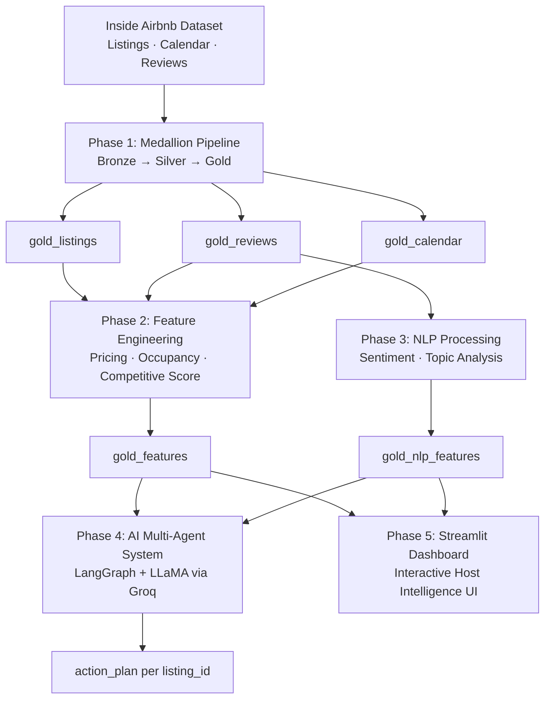

# InsideInsight: Agentic AI for Airbnb Pricing Strategy and Performance Optimization

**An end-to-end Big Data and Agentic AI system for Airbnb host intelligence**

🏆 Winner of the "Judges & Instructor's Favorite Award" @ Big Data & AI Trends Market 2026    
📍 University of Minnesota · Carlson School of Management · MSBA Program · MSBA 6331 Big Data Analytics

---

## My Individual Contribution

While this is a collaborative team project, my primary focus and core responsibility was leading **Phase 2: Feature Engineering & Analytics Pipeline**.

* **Pipeline Architecture:** Engineered and optimized the core `gold_features` Delta table within Databricks using **PySpark** to ingest cleaned multi-city Gold tables.
* **Commercial Metrics:** Handled outlier removal via IQR method, computed city-level pricing benchmarks, modeled dynamic occupancy tracking (trailing 365 days), and engineered a composite **0–100 Weighted Competitive Score**.
* **AI Integration:** Formulated the structured analytical feature layer that acts as the foundational data source grounding the downstream **Phase 4 LangGraph Multi-Agent AI system**.

---

## Executive Summary

InsideInsight transforms large-scale Airbnb data into actionable pricing and performance insights for hosts and property managers. Using the Inside Airbnb dataset — spanning listings, calendar availability, and guest reviews across multiple cities — the system delivers a scalable analytics framework that evaluates pricing strategy, occupancy performance, and customer sentiment.

The data pipeline is built on a **medallion architecture (Bronze → Silver → Gold)** using Apache Spark and Databricks, enabling efficient large-scale feature engineering. Structured outputs such as occupancy rates, pricing benchmarks, competitive scores, and sentiment insights are consolidated into analysis-ready Delta tables.

Beyond traditional analytics, a **multi-agent AI system** built with LangGraph and large language models converts structured insights into grounded, data-driven recommendations — allowing hosts to generate personalized pricing and performance strategies for individual listings.

**Key deliverables:**

- Scalable Medallion data pipeline for Airbnb data processing (Bronze → Silver → Gold)
- Feature engineering for pricing benchmarks, occupancy rates, and competitive scoring
- NLP-based sentiment and topic analysis on guest reviews
- AI-powered multi-agent recommendation engine for host decision-making
- Interactive Streamlit dashboard for exploration and insights

---

## System Architecture



---

## Repository Structure

```text
.
├── app/
│   └── app.py                          # Streamlit dashboard application
├── notebooks/
│   ├── phase_1_airbnb_bronze_layer.ipynb
│   ├── phase_1_airbnb_silver_layer.ipynb
│   ├── phase_1_airbnb_gold_layer.ipynb
│   ├── phase_2_feature_engineering.ipynb   # ← My primary contribution
│   ├── phase_3_NLP.ipynb
│   └── phase_4_AI_Agent_Model_Full_set.ipynb
├── docs/
│   ├── Phase_1_Medallion_Pipeline_Reuse_Instructions.pdf
│   ├── Phase_2_Analytics_Reuse_Instructions.pdf
│   ├── Phase_3_NLP_Reuse_Instructions.pdf
│   ├── Phase_4_AI_LangGraph_Multi-Agent_System_Reuse_Instructions.pdf
│   └── Phase_5_Dashboard_Reuse_Instructions.pdf
├── data_quality_log/
│   └── data_quality_log.html           # Data validation report
├── flyer/
│   └── flyer.pdf                       # Project summary flyer
└──  deck.pdf                            # Final presentation slide deck

```

---

## Phase 1 — Medallion Data Pipeline

**Contributor: Stephen Weiler**

Phase 1 ingests raw Inside Airbnb files and builds the Bronze → Silver → Gold table stack that all downstream phases depend on.

**Bronze Layer** — raw ingestion across three datasets:

- `reviews`: raw review text with listing linkage
- `calendar`: raw daily availability records
- `listings`: raw listing metadata, pricing, and host attributes

Each dataset is validated immediately after ingestion (row counts, schema checks, null rates) before promotion to the next layer.

**Silver Layer** — cleaning and standardization per dataset:

- `silver_listings`: cleans key analytical columns (price parsing, room type normalization, null handling), and writes to Delta
- `silver_calendar`: cleans availability flags and pricing fields, writes to Delta
- `silver_reviews`: filters null comments, cleans text fields, writes to Delta

Each Silver table is validated before handoff to the Gold layer.

**Gold Layer** — join and aggregation into analysis-ready tables:

- `gold_listings`: joins calendar aggregates (availability metrics) onto listing records; validated by city-level row counts
- `gold_reviews`: enriches review records with listing metadata (city, neighborhood, room type, price) via listing join
- `gold_calendar`: prepares daily calendar data for occupancy modeling in Phase 2

All Gold tables are written to Databricks Delta and registered in the Hive Metastore under `workspace.default`.

📄 Instructions: [docs/Phase\_1\_Medallion\_Pipeline\_Reuse\_Instructions.pdf](docs/Phase_1_Medallion_Pipeline_Reuse_Instructions.pdf)  
📓 Notebooks: [phase\_1\_airbnb\_bronze\_layer.ipynb](notebooks/phase_1_airbnb_bronze_layer.ipynb) · [phase\_1\_airbnb\_silver\_layer.ipynb](notebooks/phase_1_airbnb_silver_layer.ipynb) · [phase\_1\_airbnb\_gold\_layer.ipynb](notebooks/phase_1_airbnb_gold_layer.ipynb)

---

## Phase 2 — Feature Engineering

**Contributor: Tzu-Yu Chen**

Phase 2 transforms the cleaned Gold tables into the `gold_features` table — the core intelligence layer consumed by both the AI agent and the Streamlit dashboard.

**Step 1 — Pricing Distribution Analysis**

Establishes city-, neighborhood-, and property-type-level pricing benchmarks. Outliers are removed using the IQR method (per-city Q1/Q3 bounds computed with `percentile_approx`) before deriving medians and weekend vs. weekday price premiums.

**Step 2 — Occupancy Modeling**

Estimates demand intensity per listing from `gold_calendar` using rolling window analysis. Identifies peak and off-peak months to contextualize each listing's occupancy performance over the trailing 365 days.

**Step 3 — Competitive Score Engineering**

Calculates each listing's relative market position within its neighborhood peer group using four engineered features:

| Feature | Method | Weight |
|---|---|---|
| `price_gap_pct` | % deviation from neighborhood-and-room-type median price | 30% |
| `amenity_score` | Normalized amenity count vs. neighborhood average | 20% |
| `review_count_rank` | Percentile rank of review volume within neighborhood | 25% |
| `occupancy_rank` | Percentile rank of occupancy within neighborhood | 25% |

These are combined into a single **0–100 weighted competitive score** used downstream by the AI agent.

**Step 4 — gold_features Table**

Publishes the final engineered table to Databricks Delta via overwrite mode, joining competitive scores with peak season context. This table is the primary input for Phase 4 (AI recommendations) and Phase 5 (dashboard).

**Data Dictionary: gold_features (selected columns)**

| Column | Description |
|---|---|
| `listing_id` | Unique listing identifier |
| `city` | City of the listing |
| `neighborhood` | Neighborhood of the listing |
| `price` | Nightly listing price (USD) |
| `median_neighborhood_price` | Median price for same neighborhood and room type |
| `price_gap_pct` | % deviation from neighborhood-room-type median |
| `amenity_score` | Normalized amenity superiority score |
| `review_rank_percentile` | Percentile rank of review volume within neighborhood |
| `occupancy_rate` | Estimated occupancy rate (0–1) |
| `occupancy_rank_percentile` | Percentile rank of occupancy within neighborhood |
| `competitive_score` | Weighted composite score (0–100) |
| `peak_month` | Identified peak demand month |
| `estimated_revenue_l365d` | Estimated revenue over trailing 365 days |

📄 Instructions: [docs/Phase\_2\_Analytics\_Reuse\_Instructions.pdf](docs/Phase_2_Analytics_Reuse_Instructions.pdf)  
📓 Notebook: [phase\_2\_feature\_engineering.ipynb](notebooks/phase_2_feature_engineering.ipynb)

---

## Phase 3 — NLP Processing

**Contributor: Bhavisha Chafekar**

Phase 3 processes guest review text from `gold_reviews` into structured sentiment and topic signals, stored as `gold_nlp_features`.

**Step 1 — Dependency Setup & Data Load**

Installs NLP libraries and loads a validation sample from `gold_reviews` before running the full-corpus pipeline.

**Step 2 — Text Preprocessing in PySpark**

- Filters null comments
- Detects and retains only English reviews using `langdetect`
- Lowercases text, removes HTML entities, strips URLs, normalizes whitespace
- Truncates to 2,000 characters (safely within the 512-token transformer limit)

**Step 3 — Sentiment Scoring with DistilBERT**

Applies `distilbert-base-uncased-finetuned-sst-2-english` via a PySpark `pandas_udf` to score each review. Produces `avg_sentiment_score`, `pct_positive`, and `sentiment_category` per listing.

**Step 4 — Topic Modeling via Keyword Matching**

Tracks seven themes using keyword-based matching in PySpark: cleanliness, wifi, check-in, location, noise, host responsiveness, and value. Derives `top_praise` and `top_complaint` per listing from theme mention counts. BERTopic is run separately on a 2,000-row sample as an exploratory supplement; its findings informed the final keyword list.

**Step 5 — Validation Table**

Builds a validation version of `gold_nlp_features` on the sample before scaling to the full corpus.

**Step 6 — Full-Corpus Run & Delta Write**

Runs the complete pipeline on `gold_reviews` and writes `gold_nlp_features` to Databricks Delta.

**Step 7 — Spot-Check Validation Log**

Manually verifies 5 listings by reading their raw reviews and confirming that sentiment scores and top themes are coherent.

📄 Instructions: [docs/Phase\_3\_NLP\_Reuse\_Instructions.pdf](docs/Phase_3_NLP_Reuse_Instructions.pdf)  
📓 Notebook: [phase\_3\_NLP.ipynb](notebooks/phase_3_NLP.ipynb)

---

## Phase 4 — AI Multi-Agent System

**Contributor: Phoenix Ferrari**

Phase 4 implements a LangGraph multi-agent workflow that combines `gold_features` and `gold_nlp_features` to generate grounded, per-listing action plans.

**Data Preparation**

Both Gold tables are loaded from Databricks, converted to Pandas, and joined on `listing_id` and `city`. NLP nulls are filled with safe defaults to ensure stable prompt construction. Business logic helpers classify each listing's price position (`significantly underpriced` → `significantly overpriced`), competitive tier, and sentiment label.

**FAISS Comparable Retrieval**

A `SentenceTransformer` (`all-MiniLM-L6-v2`) embeds a structured text representation of each listing, covering price, occupancy, amenity score, review rank, competitive score, and top NLP signals. A FAISS `IndexFlatIP` index (cosine similarity on normalized vectors) enables fast nearest-neighbor lookup of comparable listings for any given `listing_id`.

**LangGraph Agent — Three-Node Pipeline**

```
retrieve → analyze → recommend
```

| Node | Role |
|---|---|
| `retrieve_node` | Fetches listing context and top comparable listings from FAISS |
| `analyze_node` | LLaMA 3.3 70B (via Groq) analyzes pricing position, occupancy, competitiveness, and sentiment using only retrieved context |
| `recommend_node` | LLaMA 3.3 70B produces exactly 3 specific, citation-grounded host recommendations |

The agent enforces strict grounding: the LLM is prompted to use only facts present in the retrieved context and to cite the source statistic behind each recommendation.

**Usage**

```python
action_plan(listing_id)
```

📄 Instructions: [docs/Phase\_4\_AI\_LangGraph\_Multi-Agent\_System\_Reuse\_Instructions.pdf](docs/Phase_4_AI_LangGraph_Multi-Agent_System_Reuse_Instructions.pdf)  
📓 Notebook: [phase\_4\_AI\_Agent\_Model\_Full\_set.ipynb](notebooks/phase_4_AI_Agent_Model_Full_set.ipynb)

---

## Phase 5 — Streamlit Dashboard

**Contributor: Jyothirmai Sri Peesapati**

Phase 5 delivers an interactive dark-themed Streamlit dashboard that gives hosts a self-serve intelligence interface over the engineered Gold tables.

**Sidebar — Listing Finder**

Users can find listings by pasting an Airbnb URL (listing ID auto-extracted via regex) or by filtering manually on city, neighborhood, room type, price range, minimum bedrooms, superhost status, occupancy threshold, and instant-bookable flag.

**Dashboard Page**

Displays five KPI cards (nightly price vs. median, price gap %, occupancy rate, annual revenue estimate, amenity score) alongside the listing's competitive score badge and neighborhood context charts.

**Pricing Simulator Page**

Interactive price slider that projects the revenue impact of adjusting nightly price, comparing simulated vs. current revenue at the listing's estimated occupancy rate.

**Health Check Page**

Scorecard view that breaks the competitive score down into its component dimensions (price positioning, occupancy rank, amenity score, review rank), with contextual interpretation of what the score means for that neighborhood tier.

**AI Advisor Page**

Passes the listing's structured context block (price, price gap, occupancy, revenue, competitive score, amenity score, peak month, sentiment, top praise/complaint) to the Groq-hosted LLaMA model and streams back a grounded action plan with three specific recommendations.

**Running the Dashboard**

```bash
python -m streamlit run app/app.py
```

📄 Instructions: [docs/Phase\_5\_Dashboard\_Reuse\_Instructions.pdf](docs/Phase_5_Dashboard_Reuse_Instructions.pdf)

---

## Setup & Usage

### Prerequisites

- Databricks workspace with access to `workspace.default` schema
- Python 3.10+
- PySpark / Pandas
- Groq API key (for Phase 4 AI agent and Phase 5 AI advisor)

### Accessing Final Tables

All Gold tables are stored in Databricks:

```python
spark.table('workspace.default.gold_listings')
spark.table('workspace.default.gold_features')
spark.table('workspace.default.gold_nlp_features')
```

### Notes

- Calendar pricing fields were null across all cities; listing price is used instead
- Some reviews without matching listings were removed
- Multi-unit listings may appear duplicated by design

---

## Dataset

**Inside Airbnb** — [https://insideairbnb.com/get-the-data](https://insideairbnb.com/get-the-data)

| File | Contents |
|---|---|
| `listings.csv` | Pricing, amenities, host attributes, location |
| `calendar.csv` | Daily availability and pricing |
| `reviews.csv` | Guest review text |

---

## Tools & Technologies

| Layer | Technology |
|---|---|
| Data processing | Apache Spark · PySpark · Databricks |
| Storage | Delta Lake · Hive Metastore |
| Feature engineering | PySpark ML · Pandas |
| NLP | DistilBERT · VADER · BERTopic · `langdetect` |
| Vector search | FAISS · SentenceTransformers (`all-MiniLM-L6-v2`) |
| AI agent | LangGraph · LLaMA 3.3 70B (via Groq API) |
| Dashboard | Streamlit · Plotly |

---

## Team

**Team 9 — MSBA 6331 Big Data Analytics**

| Member | Primary Responsibility |
|---|---|
| Stephen Weiler | Phase 1: Medallion Data Pipeline |
| Tzu-Yu Chen | Phase 2: Feature Engineering |
| Bhavisha Chafekar | Phase 3: NLP Processing |
| Phoenix Ferrari | Phase 4: AI Multi-Agent System |
| Jyothirmai Sri Peesapati | Phase 5: Streamlit Dashboard |

---

## Usage and License Note

This repository is shared for academic and portfolio purposes. Please contact the author before reusing or redistributing the code.
