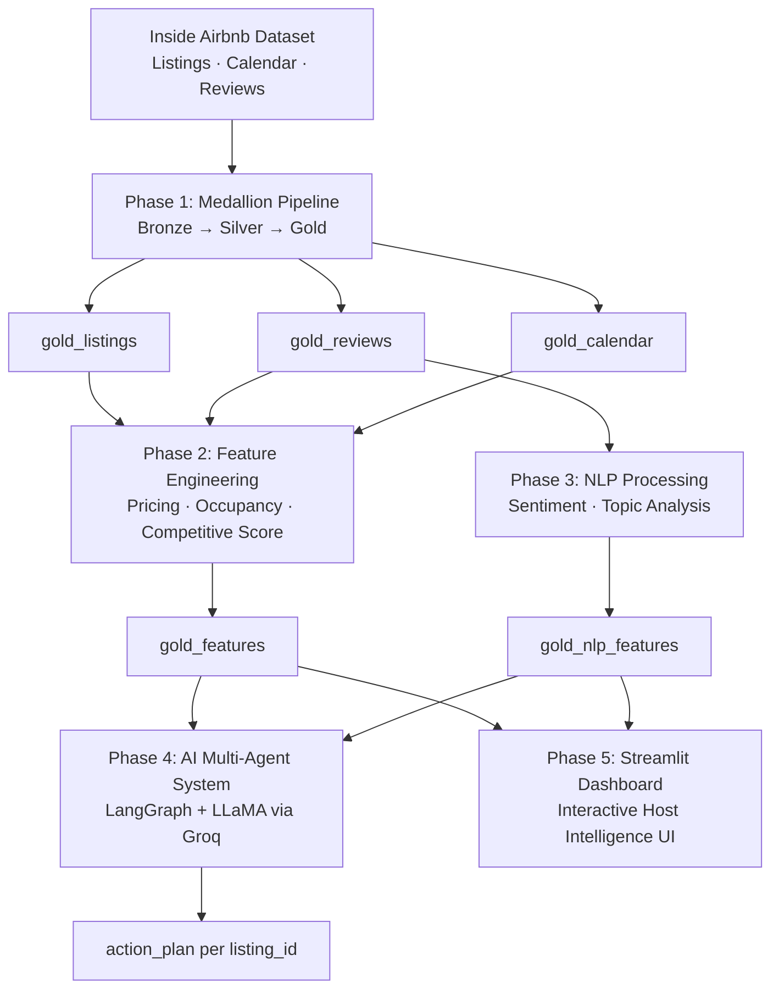

# InsideInsight: Agentic AI for Airbnb Pricing Strategy and Performance Optimization

**An end-to-end Big Data and Agentic AI system for Airbnb host intelligence**

📍 University of Minnesota · Carlson School of Management · MSBA Program · MSBA 6331 Big Data Analytics

---

## Executive Summary

InsideInsight transforms large-scale Airbnb data into actionable pricing and performance insights for hosts and property managers. Using the Inside Airbnb dataset — spanning listings, calendar availability, and guest reviews across multiple cities — the system delivers a scalable analytics framework that evaluates pricing strategy, occupancy performance, and customer sentiment.

The data pipeline is built on a **medallion architecture (Bronze → Silver → Gold)** using Apache Spark and Databricks, enabling efficient large-scale feature engineering. Structured outputs such as occupancy rates, pricing benchmarks, competitive scores, and sentiment insights are consolidated into analysis-ready Delta tables.

Beyond traditional analytics, a **multi-agent AI system** built with LangGraph and large language models converts structured insights into grounded, data-driven recommendations — allowing hosts to generate personalized pricing and performance strategies for individual listings.

**Key deliverables:**

- Scalable Medallion data pipeline for Airbnb data processing (Bronze → Silver → Gold)
- Feature engineering for pricing benchmarks, occupancy rates, and competitive scoring
- NLP-based sentiment and topic analysis on guest reviews
- AI-powered recommendation engine for host decision-making
- Interactive Streamlit dashboard for exploration and insights

---

## System Architecture



---

## Repository Structure

```text
.
├── app/
│   └── app.py                          # Streamlit dashboard application
├── notebooks/
│   ├── phase_1_airbnb_bronze_layer.ipynb
│   ├── phase_1_airbnb_silver_layer.ipynb
│   ├── phase_1_airbnb_gold_layer.ipynb
│   ├── phase_2_feature_engineering.ipynb   # ← My primary contribution
│   ├── phase_3_NLP.ipynb
│   └── phase_4_AI_Agent_Model_Full_set.ipynb
├── docs/
│   ├── Phase_1_Medallion_Pipeline_Reuse_Instructions.pdf
│   ├── Phase_2_Analytics_Reuse_Instructions.pdf
│   ├── Phase_3_NLP_Reuse_Instructions.pdf
│   ├── Phase_4_AI_LangGraph_Multi-Agent_System_Reuse_Instructions.pdf
│   └── Phase_5_Dashboard_Reuse_Instructions.pdf
├── data_quality_log/
│   └── data_quality_log.html           # Data validation report
├── flyer/
│   └── flyer.pdf                       # Project summary flyer
├── deck.pdf                            # Final presentation slide deck
└── deck.pptx                           # Final presentation (editable)
```

---

## My Contribution — Phase 2: Feature Engineering

Phase 2 is responsible for transforming the cleaned Gold tables into the `gold_features` table — the core intelligence layer consumed by both the AI agent and the Streamlit dashboard.

### What Phase 2 Builds

**Step 1 — Pricing Distribution Analysis**
Establishes city-, neighborhood-, and property-type-level pricing benchmarks. Outliers are removed using the IQR method (per-city Q1/Q3 bounds) before computing medians and weekend vs. weekday price premiums.

**Step 2 — Occupancy Modeling**
Estimates demand intensity per listing from `gold_calendar` using rolling window analysis. Identifies peak and off-peak months to contextualize occupancy performance over the trailing 365 days.

**Step 3 — Competitive Score Engineering**
Calculates each listing's relative market position within its neighborhood peer group using four engineered features:

| Feature | Method | Weight |
|---|---|---|
| `price_gap_pct` | % deviation from neighborhood-room-type median price | 30% |
| `amenity_score` | Normalized amenity count vs. neighborhood average | 20% |
| `review_count_rank` | Percentile rank within neighborhood (trust proxy) | 25% |
| `occupancy_rank` | Percentile rank of occupancy within neighborhood | 25% |

These are combined into a single **0–100 weighted competitive score** used downstream by the AI agent.

**Step 4 — gold_features Table**
Publishes the final engineered table to Databricks Delta (Hive Metastore) via overwrite mode, joining competitive scores with peak season context. This table is the primary input for Phase 4 (AI recommendations) and Phase 5 (dashboard).

### Data Dictionary: gold_features (selected columns)

| Column | Description |
|---|---|
| `listing_id` | Unique listing identifier |
| `city` | City of the listing |
| `neighborhood` | Neighborhood of the listing |
| `price` | Nightly listing price (USD) |
| `price_gap_pct` | % deviation from neighborhood-room-type median |
| `amenity_score` | Normalized amenity superiority score |
| `review_count_rank` | Percentile rank of review volume within neighborhood |
| `occupancy_rate` | Estimated occupancy rate (0–1) |
| `occupancy_rank` | Percentile rank of occupancy within neighborhood |
| `competitive_score` | Weighted composite score (0–100) |
| `peak_month` | Identified peak demand month |
| `estimated_revenue_l365d` | Estimated revenue over trailing 365 days |

---

## Setup & Usage

### Prerequisites

- Databricks workspace with access to `workspace.default` schema
- Python 3.10+
- PySpark / Pandas
- Groq API key (for Phase 4 AI agent)

### Quick Start

The project runs in phases. Each phase produces tables consumed by the next.

#### Phase 1 — Data Pipeline

Builds Bronze → Silver → Gold tables from the raw Inside Airbnb dataset.

Output tables: `gold_listings`, `gold_reviews`, `gold_calendar`

```text
📄 Instructions: docs/Phase_1_Medallion_Pipeline_Reuse_Instructions.pdf
📓 Notebooks:    notebooks/phase_1_airbnb_bronze_layer.ipynb
                 notebooks/phase_1_airbnb_silver_layer.ipynb
                 notebooks/phase_1_airbnb_gold_layer.ipynb
```

#### Phase 2 — Feature Engineering

Builds the `gold_features` table with pricing benchmarks, occupancy rates, and competitive scores.

```text
📄 Instructions: docs/Phase_2_Analytics_Reuse_Instructions.pdf
📓 Notebook:     notebooks/phase_2_feature_engineering.ipynb
```

#### Phase 3 — NLP Processing

Builds `gold_nlp_features` from guest review sentiment and topic analysis (VADER + transformer methods).

```text
📄 Instructions: docs/Phase_3_NLP_Reuse_Instructions.pdf
📓 Notebook:     notebooks/phase_3_NLP.ipynb
```

#### Phase 4 — AI Multi-Agent System

Generates per-listing action plans by combining `gold_features` and `gold_nlp_features` through a LangGraph multi-agent workflow.

```python
action_plan(listing_id)
```

```text
📄 Instructions: docs/Phase_4_AI_LangGraph_Multi-Agent_System_Reuse_Instructions.pdf
📓 Notebook:     notebooks/phase_4_AI_Agent_Model_Full_set.ipynb
```

#### Phase 5 — Dashboard (Optional)

Run the Streamlit dashboard locally:

```bash
python -m streamlit run app/app.py
```

```text
📄 Instructions: docs/Phase_5_Dashboard_Reuse_Instructions.pdf
```

### Accessing Final Tables

All Gold tables are stored in Databricks:

```python
spark.table('workspace.default.gold_listings')
spark.table('workspace.default.gold_features')
spark.table('workspace.default.gold_nlp_features')
```

---

## Dataset

**Inside Airbnb** — [https://insideairbnb.com/get-the-data](https://insideairbnb.com/get-the-data)

| File | Contents |
|---|---|
| `listings.csv` | Pricing, amenities, host attributes, location |
| `calendar.csv` | Daily availability and pricing |
| `reviews.csv` | Guest review text |

> **Note:** Calendar pricing fields were null across all cities; listing price is used instead. Some reviews without matching listings were removed. Multi-unit listings may appear duplicated by design.

---

## Tools & Technologies

| Layer | Technology |
|---|---|
| Data processing | Apache Spark · PySpark · Databricks |
| Storage | Delta Lake · Hive Metastore |
| Feature engineering | PySpark ML · Pandas |
| NLP | VADER · Transformer-based sentiment models |
| AI agent | LangGraph · LLaMA (via Groq API) |
| Dashboard | Streamlit · Plotly |

---

## Team

**Team 9 — MSBA 6331 Big Data Analytics**

| Member | Primary Responsibility |
|---|---|
| Bhavisha Chafekar | — |
| Jyothirmai Sri Peesapati | — |
| Phoenix Ferrari | — |
| Stephen Weiler | — |
| **Tzu-Yu Chen** | **Phase 2: Feature Engineering** |

---

## Usage and License Note

This repository is shared for academic and portfolio purposes. Please contact the author before reusing or redistributing the code.
